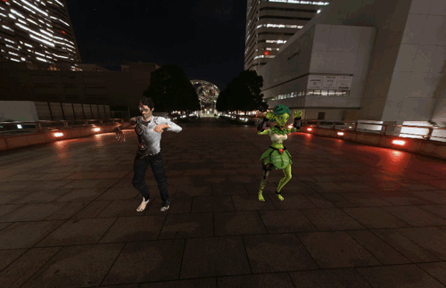
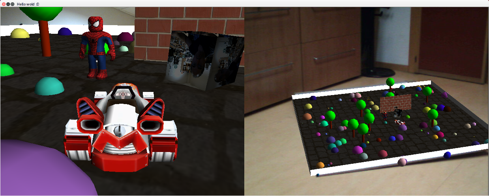
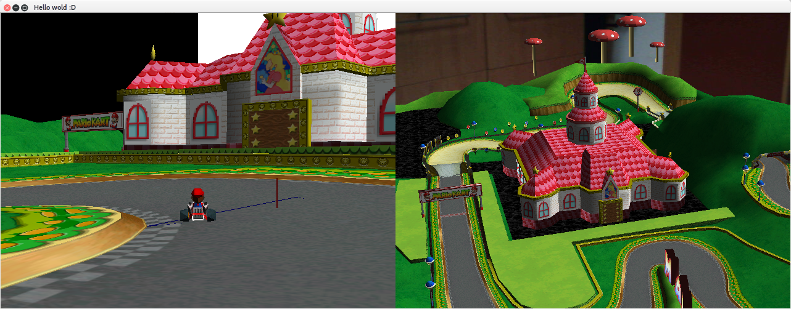

# ProgramacionAvanzada
## Material de la Asignatura de Programación Avanzada
En esta asignatura de construye un motor de video juegos desde cero a la vez que se introducen conceptos avanzados de programación orientada a objetos y C++.

# Características
* Camaras: Rotacion esferica, primera persona, voladora, tercera persona, realidad aumentada.
* Manipula texturas con OpenCV, de cualquier formato, url o camara en directo.
* Motor fisico de particulas.
* Lee formatos .obj con ilimitadas texturas. Faltan transparencias.
* Permite varias vistas

Desde 2020

* Permite programacion de GLSL shaders, VBO, VBA, FBO.
* Permite modelos renderizados con shader y solo una textura.
* Permite modelos articulados con shader y con una textura.
* Permite modelos articulados y animados con shader y con una textura.
* Parser XML en 300 líneas de código sin punteros.
* Servicios de networking: Servidor streaming de imagenes, recepción de datos de sensores Wiimote, servidor http sencillo con protocolo CGI.
* Lee formatos .dae con una textura, articulaciones y animacion de articulaciones.
* Permite Realidad Virtual con movil y un servidor python modificado de Trinus VR. 
* Pequeña librería para utilizar Quaterniones en las rotaciones.
* Motor fisico de solidos rigidos (faltan colisiones).
* SkyBox

Desde 2021
* GPGPU programación general con shader
* Renderización de código RayMarching con SignedDistanceFunctions (SDF)
* Podemos utilizar código de ShaderToy.com (Gracias Iñigo)
* SolidRayMarching integra los shader RayMarching con los objetos del motor, como un solido más.

Ejemplo de modelos procedural de montañas (Iñigo Kilez) interactivo. 
Podemos volar por entre estas montañas como queramos para siempre.

Ejemplo del ShaderToy Bouncing de Iñigo Kilez, integrado con el modelo de spiderman.

Ejemplo de modelos .DAE con textura, articulados y animados renderizados con Shader y SkyBox

En la captura de pantalla se muestra dos objetos obj, spiderman y mariokart, una vista en tercera persona y una en realidad aumentada sobre el suelo de mi despacho. Un cubo animado con el motor físico, con una textura de camara en directo.

Simulación del juego MarioKart. 

Las vistas de la derecha son en realidad aumentada sobre el suelo de mi despacho.

